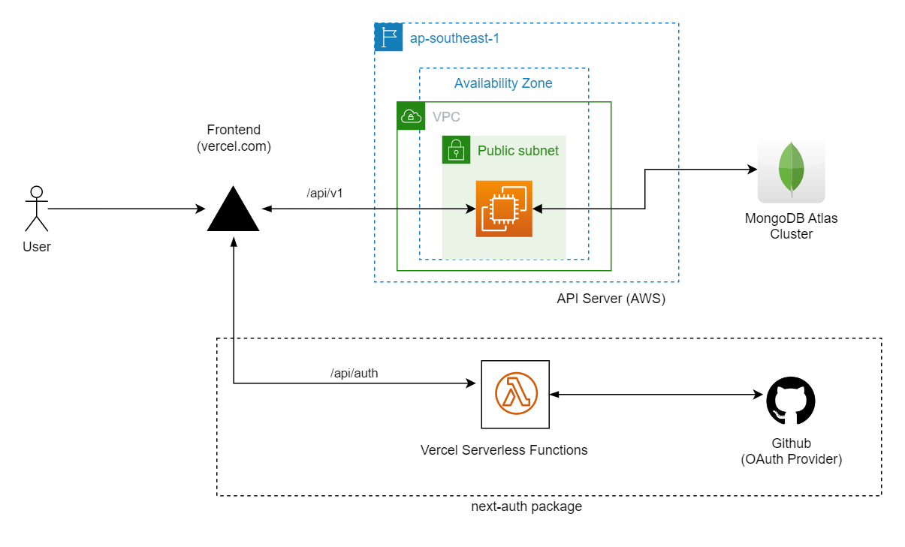

# Next.js + Express.js Full Stack Application


## Features
- ### Express API
  - JWT authentication/ OAuth2 support
  - Request Validation
- ### Next.js
  - Authentication with Next-Auth which supports OAuth 2.0
  - MUI / Tailwind styling
### Apps and Packages

- [`apps/api`](./apps/api): a [Express.js](https://expressjs.com/) app
- [`apps/web`](./apps/web): a [Next.js](https://nextjs.org/) app
- [`packages`](./packages)
  - `eslint-config-custom`: custom `eslint` config used throughout the monorepo
  - `tsconfig`: `tsconfig.json`s used throughout the monorepo
### Architecture



### Development

Download dependencies
```shell
npm install
```
Create a `.env` file on the <b>root</b> and add `MongoDB Connection String/URL` as Environment Variable

```
MONGODB_URL=mongodb+srv://...
```
To develop all apps and packages, run the following command:

```
npm run dev
```
- Open [http://localhost:3000](http://localhost:3000) to see the frontend
- Open [http://localhost:8080](http://localhost:8080) to see the backend

To Start frontend and backend indvidually, run following command

```bash
# to run backend
npm run dev:api

# to run frontend
npm run dev:web
```

### Testing

### 1. Unit Testing
To test all apps, run the following command:

```
npm run test
```

To Run unit tests seperately on frontend and api

```bash
# to run backend
npm run test:api

# to run frontend
npm run test:web
```

### 2. End-to-End (E2E) / Integration Testing

To run end-to-end testing using cypress. 
```bash
# build apps using 
npm run build

#start apps
npm start

# Run the end-to-end testing
cd apps/web; npm run e2e
```
To learn more about testing with cypress on Next.js https://nextjs.org/docs/testing#running-your-cypress-tests

### Build

To build all apps and packages, run the following command:

```
npm run build
```
## API Documentation
API Documentation available via Swagger UI endpoint located at `/api/v1/docs` endpoint
 - [development](http://localhost:8080/api/v1/docs)
 - [production](https://employee-api-soqb.onrender.com/api/v1/docs)

## Logs
- Frontend logs are handled by [sentry.io](https://sentry.io/). To configure, create a sentry project add following environment variable.

```
SENTRY_DSN = 
SENTRY_AUTH_TOKEN =
```
## TODO
- [x] Add JWT token authentication 
- [ ] Add Refresh token support on frontend
- [ ] Add full OAuth 2.0 support along with credential login
- [ ] Add Role-Based Authorization
- [ ] Add S3 Image upload function

## Useful Links

- [TurboRepo](https://turbo.build/) - MonoRepo used in this application.
- [Sentry](https://sentry.io/) - Centralized Error and Log handling.
- [Express.js](https://expressjs.com/) - Express.js
- [Next.js](https://nextjs.org/) - Next.js
